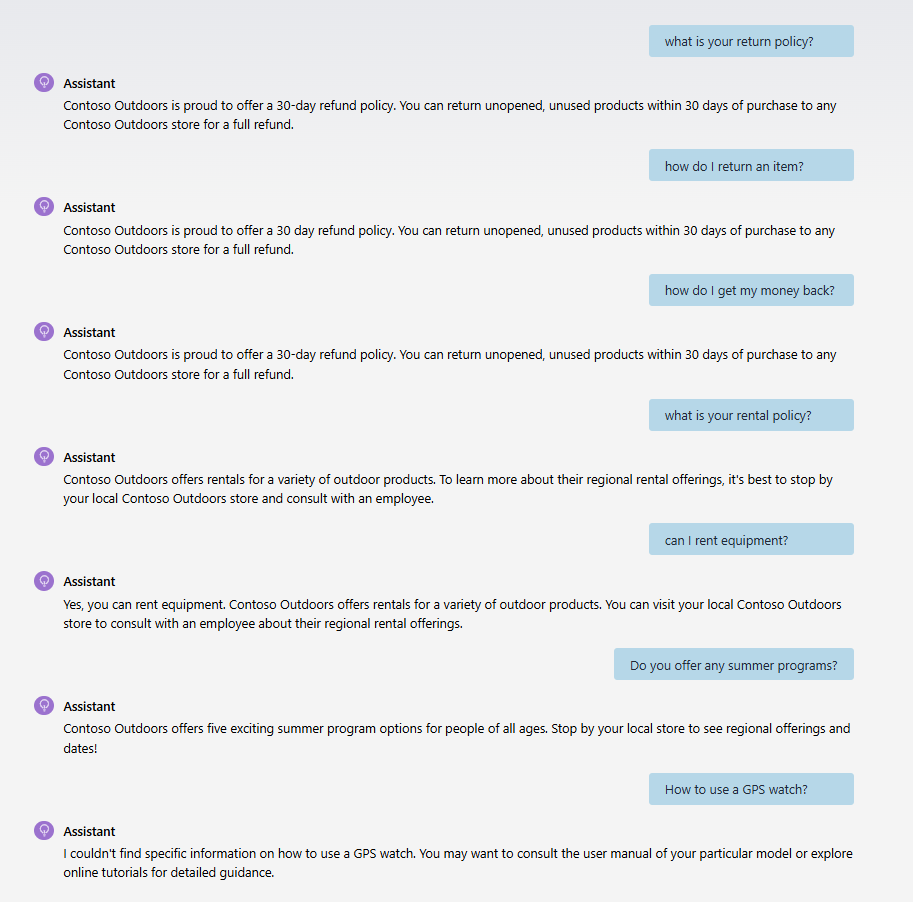

# Exact QnA Agent using .NET Aspire, Semantic Kernel SDK, and Azure Managed Redis

## Overview
The Exact QnA Agent returns consistency and accurate answer from the various questions customers ask. It is built using the ChatCompletionAgent using Semantic Kernel SDK and the .NET Aspire framework. Azure Managed Redis is used as a knowledge store for providing consistent answers to the questions. It's accomplished through vector similarity search with the Semantic Kernel plugin pattern.

### Example output of the agent application



## Run in Azure

### Deployment Steps

1. Download or fork / clone this project
1. Open a command prompt
1. Change directory to the AppHost folder
1. run ```azd up```
1. Wait for the azd process to finish
1. Change directory to *Preload-KB-Redis* folder. Set the following user-secrets to point to the resources you just provisioned:
    - Redis:SemanticCacheAzureProvider <rediss://:redis-primary-key@redis-domain-name:10000>
    - Redis:connectionString <redis-domain-name:10000,password=redis-primary-key,ssl=True,abortConnect=False>
    - AOAIResourceName <i.e. myAOAIResource, just the name, without domain>
    - AOAI:endpoint <https://resource-name.openai.azure.com/>
    - AOAI:embeddingDeploymentName <i.e. myEmbeddingDeploymentName>
    - AOAI:apiKey <i.e. AOAI API Key>
1. Run the *Preload-KB-Redis* project locally to load some information into Redis
1. Bring up the ChatClient serivce and try asking questions like:
    - What is your return policy?
    - What are your summer programs?
    - What are the rules to return products and get my money back?
    
    Observe the behavior from consistent answers to these quetions. 

### Resources provisioned
- Azure Container Environment
- Two Container apps: *ChatClient* and *AgentAPI*
- Azure Managed Redis
- Azure Open AI
- GPT 4.1 model
- Ada Text Embedding model

### Clean up

run ```azd down```